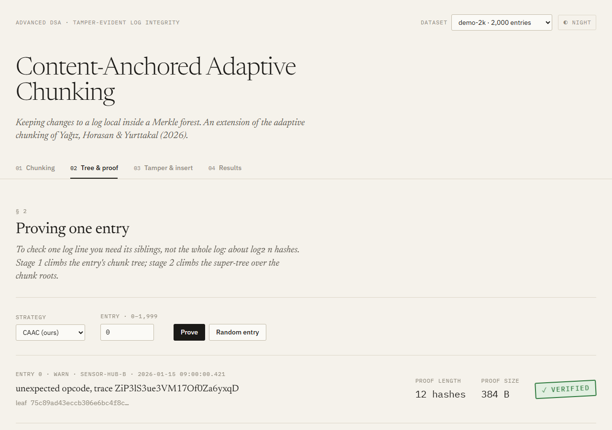
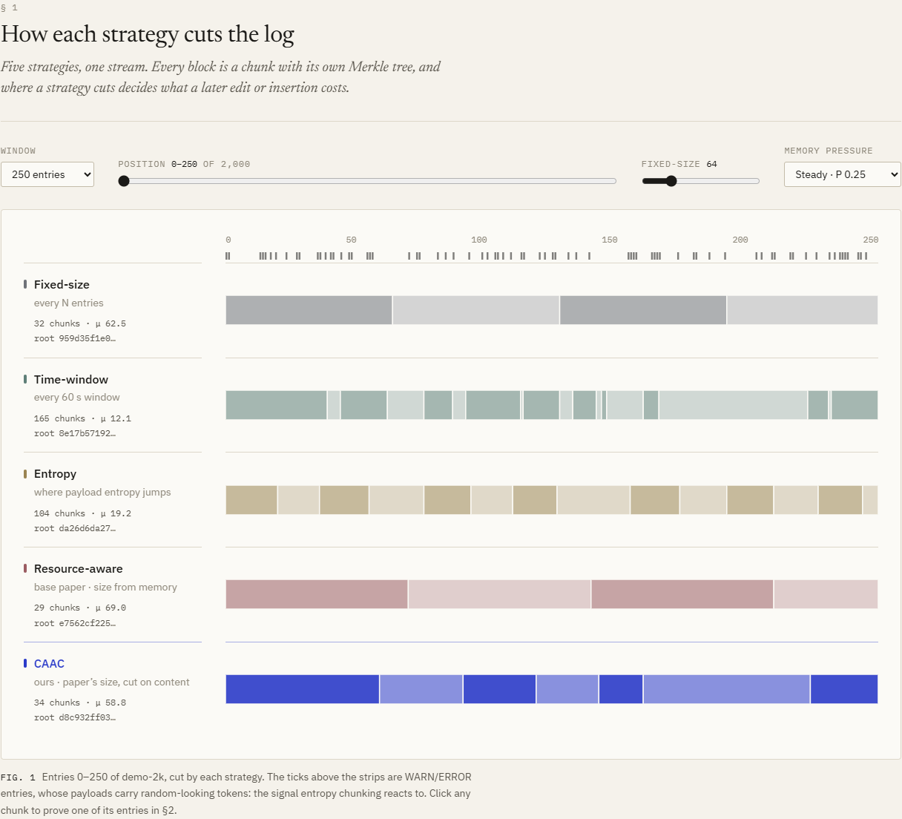
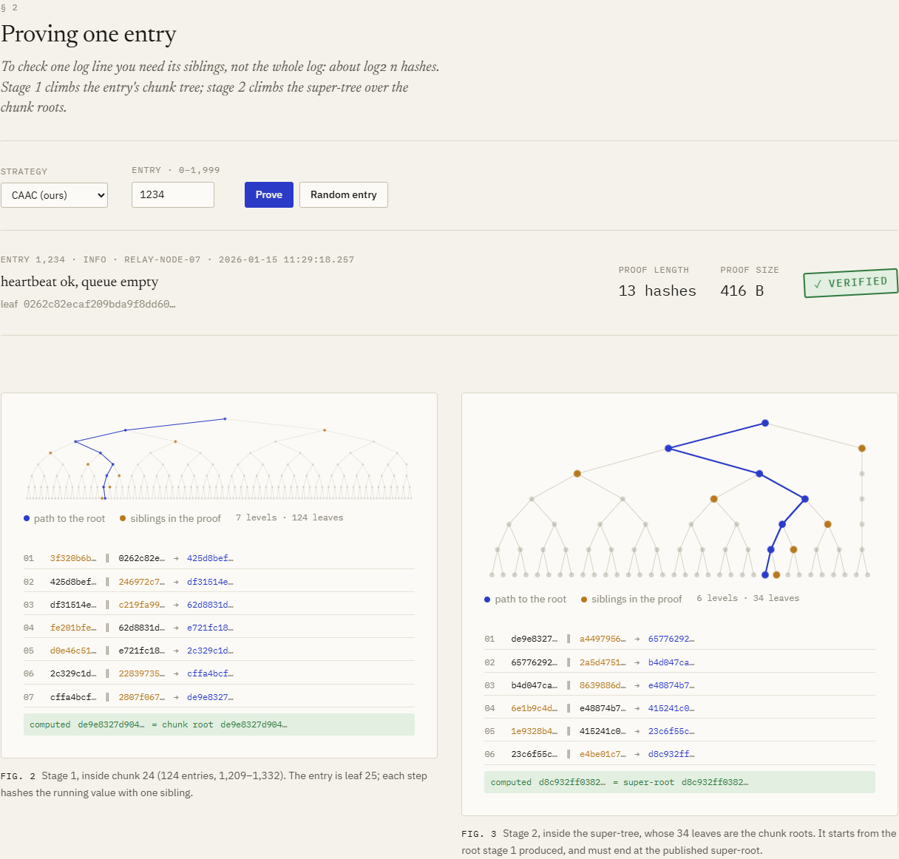
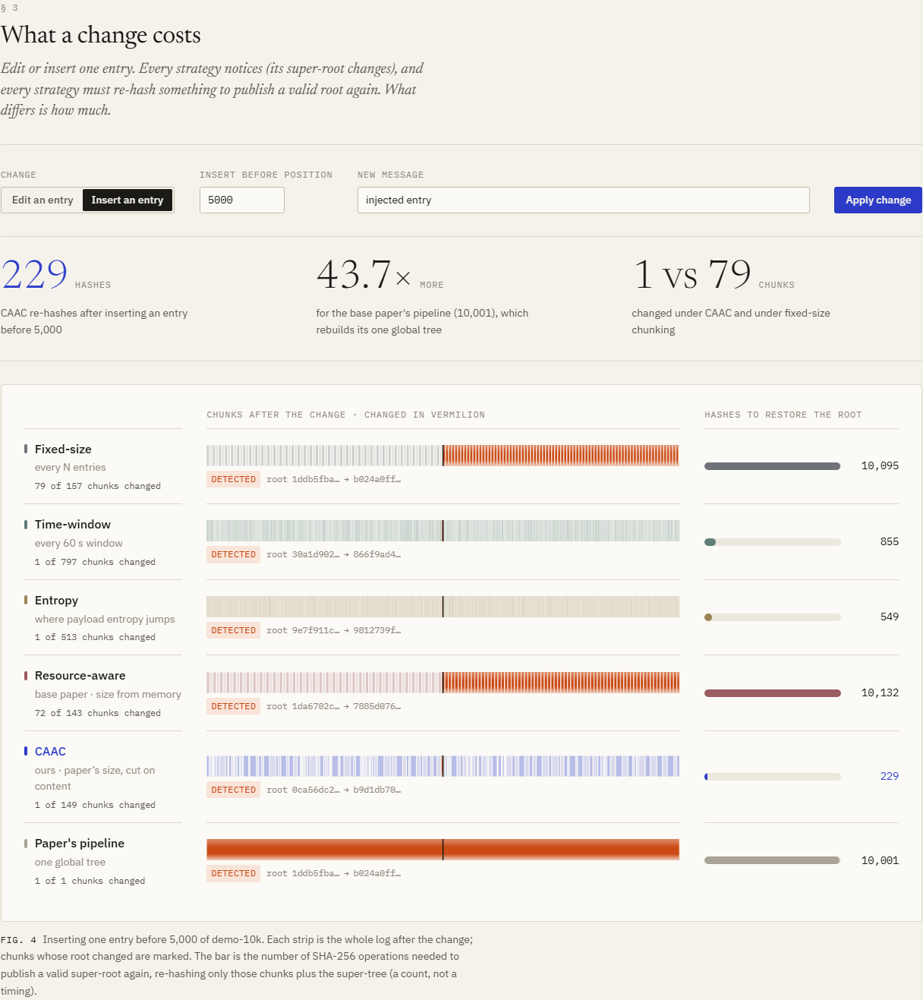
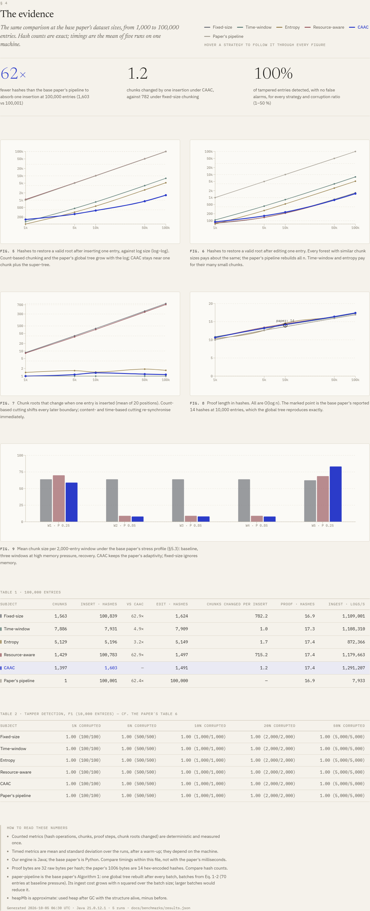

# Content-Anchored Adaptive Chunking (CAAC)

**Tamper-evident log integrity with Merkle forests, where a change to the log stays local.**

An Advanced DSA course project (B.Tech AI & Data Science). Log entries are hashed (SHA-256)
into Merkle trees, so tampering with any entry is detected and pinned down in O(log n) with an
inclusion proof, instead of re-hashing the whole log. Our contribution is **CAAC**, a chunking
strategy that extends the adaptive chunking of Yağız, Horasan and Yurttakal (2026) so that
inserting or editing an entry only touches the chunks around it.



## The result in one table

At 100,000 log entries, the number of SHA-256 operations needed to publish a valid root again
after one change (exact counts, from [`docs/benchmarks/`](docs/benchmarks/)):

| | After **inserting** one entry | After **editing** one entry | Chunks changed by an insertion |
|---|---:|---:|---:|
| Base paper's pipeline (one global tree) | 100,001 | 100,000 | — |
| Fixed-size chunking | 100,839 | 1,624 | 782 |
| Paper's resource-aware sizing | 100,783 | 1,497 | 715 |
| Time-window chunking | 7,931 | 7,909 | 1.0 |
| Entropy chunking | 5,196 | 5,149 | 1.7 |
| **CAAC (ours)** | **1,603** | **1,491** | **1.2** |

- **~62× fewer hashes than the base paper** to absorb an insertion, and ~67× fewer for an edit.
  The gap grows with the log (27× at 10k entries).
- **Count-based chunking shifts every later boundary** on an insertion; CAAC re-synchronises
  after about one chunk.
- **Time-window and entropy chunking are local too**, but they cut 3.7–5.6× more, much smaller
  chunks, so every rebuild costs 3–5× more, and they ignore the device's memory budget. CAAC is
  the only strategy that keeps insertions local *and* keeps chunk sizes at the paper's
  memory-aware target.
- **What CAAC does not change:** proofs are ~17 hashes at 100k for every strategy (all
  O(log n)), and tamper detection is 100% for every strategy, as in the paper.

## How it works

The log is split into **chunks**. Each chunk gets its own Merkle tree, and the chunk roots are
sealed under one **super-root**: the single hash that is published as the trusted anchor.

```
                     super-root            <- published (the trusted anchor)
                 /       |       \
           root(C0)   root(C1)   root(C2)  <- one Merkle tree per chunk
            /   \       /   \       /   \
          ...   ...   ...   ...   ...   ...  <- log entries, hashed into leaves
```

Proving one entry is two short climbs: from the entry to its chunk root, then from the chunk
root to the super-root, about log₂ n hashes in all. Where the log is cut decides how much must
be re-hashed when the log changes, and that is what this project is about.

### The base paper, and what CAAC changes

The base paper sizes its batches from memory pressure (its Eq. 1–2): smaller batches when memory
is tight. But its batches do not shape the tree: it keeps **one global tree and rebuilds it after
every batch**, O(n) each time (the paper's own limitation L4), and its cut points depend on how
much memory happens to be free.

CAAC keeps the paper's sizing rule unchanged and adds two things:

1. **Content-anchored cut points.** Inside the paper's size range, a chunk ends after an entry
   whose leaf hash has its low bits all zero. Whether an entry is an anchor depends only on that
   entry, so an insertion or edit cannot move the boundaries elsewhere in the log, and the same
   log always splits the same way.
2. **One tree per chunk.** A change re-hashes the affected chunk plus the small super-tree,
   O(c + k), instead of the whole log.

> The paper decides **how big** a chunk may be. CAAC also decides **exactly where** to cut, so
> changes stay local.

The paper's method is implemented as faithfully as we can, not weakened, and it is credited
wherever it appears.

## The visualiser

A React app on top of a Spring Boot API that runs the real engine. The browser never hashes or
chunks anything itself, so every hash on screen comes from the tested Java code.

| | |
|---|---|
| **§1 Chunking**: the same log cut by all five strategies, to scale. Change the fixed chunk size or the memory pressure and watch which boundaries move. Click a chunk to prove one of its entries. |  |
| **§2 Tree & proof**: an entry's proof drawn on the real trees. The path climbs one level at a time beside the verifier's trace, and the verdict is stamped at the end. |  |
| **§3 Tamper & insert**: one edit or insertion, every strategy side by side: which chunks changed and how many hashes the rebuild costs. **§3.1** anchors the root, rewrites an entry directly in PostgreSQL, and shows verification failing. |  |
| **§4 Results**: the benchmark as figures and tables. Hover a strategy to follow it through every figure. |  |

Design system: [`frontend/DESIGN.md`](frontend/DESIGN.md).

## Running it

You need Java 21 and Maven; the API and visualiser also need PostgreSQL and Node.js.

**Engine, tests, benchmark** (no database needed):

```bash
cd backend
mvn test                                                         # 359 tests
mvn -q compile
java -cp target/classes com.merklelog.demo.DemoRunner            # console walkthrough
java -cp target/classes com.merklelog.benchmark.BenchmarkRunner  # full benchmark, ~6 min
```

The console demo uses a fixed-seed log, so it prints the same hashes on every machine; a captured
run is in [`docs/demo-output.txt`](docs/demo-output.txt).

**API and visualiser:**

```bash
# once: a database and user for the app
psql -U postgres -c "CREATE ROLE merklelog LOGIN PASSWORD '<password>'"
psql -U postgres -c "CREATE DATABASE merklelog OWNER merklelog"
# then put the password in backend/config/application.yml (git-ignored):
#   spring:
#     datasource:
#       password: <password>

cd backend  && mvn spring-boot:run          # API on :8080; creates the schema, seeds demo logs
cd frontend && npm install && npm run dev    # visualiser on http://localhost:5173
```

<details>
<summary>API endpoints</summary>

All under `/api`; strategies are chosen with `?strategy=` plus optional parameters, e.g.
`?strategy=fixed-size&chunkSize=32` or `?strategy=caac&pressureProfile=0.25,0.85`.

| Method | Path | |
|---|---|---|
| GET | `/strategies` | the five strategies and their defaults |
| GET / POST | `/datasets` | list or generate stored logs |
| GET | `/datasets/{id}/entries?offset=&limit=` | entries with their leaf hashes |
| GET | `/datasets/{id}/chunks` | boundaries, sizes, chunk roots, super-root |
| GET | `/datasets/{id}/chunks/{c}/tree`, `/datasets/{id}/supertree` | trees as levels of hashes |
| GET | `/datasets/{id}/proof/{i}` | two-stage proof with every verification step |
| POST | `/datasets/{id}/tamper` | one edit or insertion compared across all strategies |
| POST / GET | `/datasets/{id}/anchors`, `/datasets/{id}/anchors/verify` | trusted root anchor |
| PUT | `/datasets/{id}/entries/{pos}` | rewrite a stored entry (the attacker, for the demo) |
| GET | `/benchmarks` | the committed benchmark results |
| POST | `/admin/seed` | rebuild the demo data from an empty database |

</details>

## Under the hood

- **Hashing:** real SHA-256 with RFC 6962 domain separation (`0x00` leaf / `0x01` node prefix);
  an odd node is promoted, never duplicated (avoids the Bitcoin CVE-2012-2459 forgery).
- **Trees** are stored as arrays of levels, so a proof is pure index arithmetic (sibling `i ^ 1`,
  parent `i >> 1`): genuinely O(log n), never a scan.
- **Rebuild costs are counted, not estimated:** every leaf and node hash increments a counter,
  and the tests assert the counted work.
- **Stack:** Java 21 · Spring Boot 3.5 · PostgreSQL 18 (Flyway) · React + TypeScript (Vite) ·
  Tailwind CSS · Recharts. The engine (`core/`, `chunking/`, `benchmark/`) has no Spring code
  and is tested with plain JUnit.

Details: [`docs/architecture.md`](docs/architecture.md) (design and complexity),
[`docs/benchmarks/README.md`](docs/benchmarks/README.md) (benchmark method),
[`instructions.md`](instructions.md) (full project spec).

## Caveats we state up front

- The data is synthetic IoT logs with a fixed seed, at the paper's sizes (1k–100k entries); the
  paper also uses synthetic data.
- Our engine is Java and the paper's is Python, so absolute timings are not comparable; hash
  counts are.
- The paper reports proof sizes with hex-encoded hashes (1,006 B for 14 hashes); we compare hash
  counts, and our global tree reproduces its 14 hashes at 10k entries.
- The paper's pipeline rebuilds its tree after every batch (Algorithm 1 as published), which makes
  its ingest slow at large n. Larger batches would speed up its ingest, but not its edit or
  insertion cost, which is always about n.
- CAAC's boundaries are content-anchored *within* a memory-pressure regime: when the pressure
  changes, its size range (and so some boundaries) changes with it.
- Entropy chunking on short log messages is a weak signal (a 32-byte window cannot measure more
  than 5 bits/byte); it is guarded with minimum and maximum chunk sizes.

## Status

- ✅ Engine: hashing, trees, proofs, Merkle forest, five chunking strategies, the paper's
  pipeline, counted localised rebuilds
- ✅ Benchmark at the paper's sizes, 5 runs each ([results](docs/benchmarks/))
- ✅ REST API, PostgreSQL persistence, trusted root anchors (359 tests, all passing)
- ✅ Visualiser: chunking, tree & proof, tamper & insert, results
- ⏳ Deployment on Render

## Team

- Vipin Sudhakar — CB.AI.U4AID25166
- Rithvik Arulprakash — CB.AI.U4AID25148
- Harshith KV — CB.AI.U4AID25119
- Venugopalan G — CB.AI.U4AID25115

## Reference

Yağız, M. A., Horasan, F., Yurttakal, A. H. *Lightweight Tamper-Evident Log Integrity
Verification for IoT Edge Environments: A Merkle-Tree Pipeline with Adaptive Chunking.*
arXiv:2605.00065, 2026. Our baseline implements its Eq. 1–2 and Algorithm 1; CAAC extends them.
